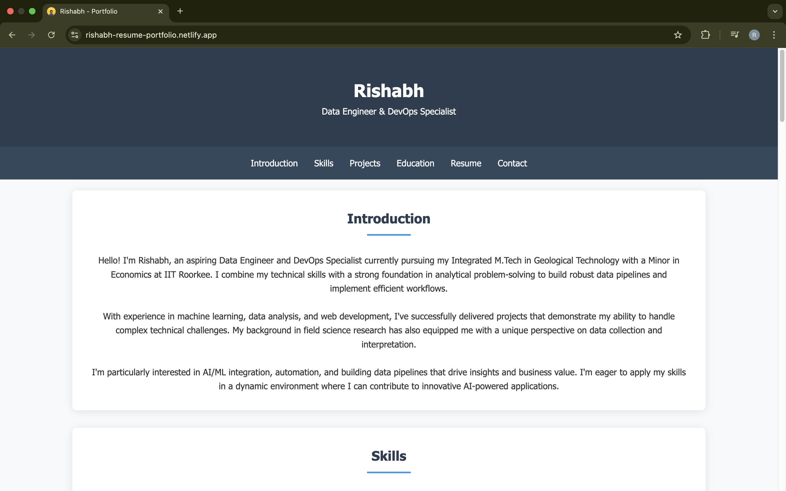
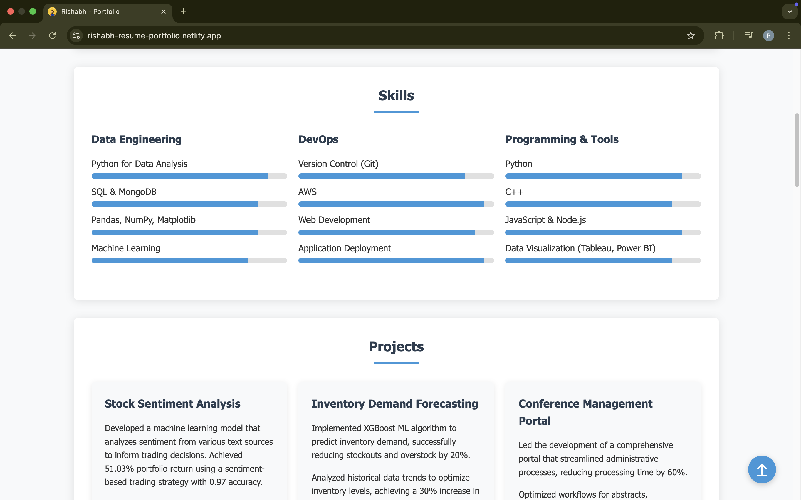
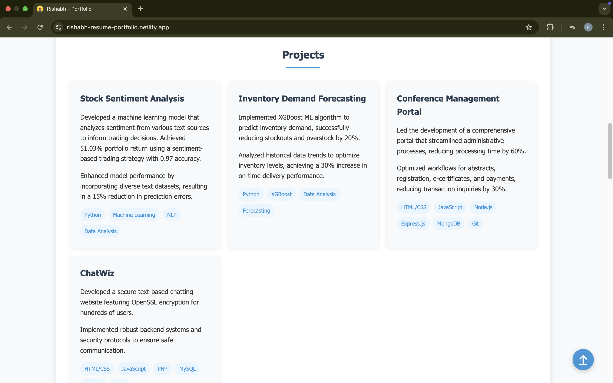
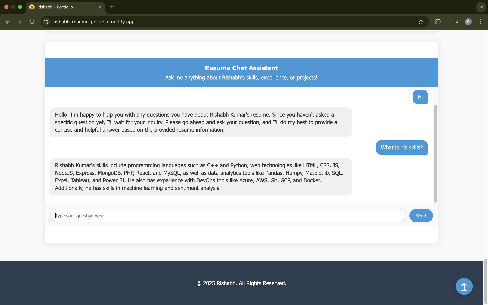
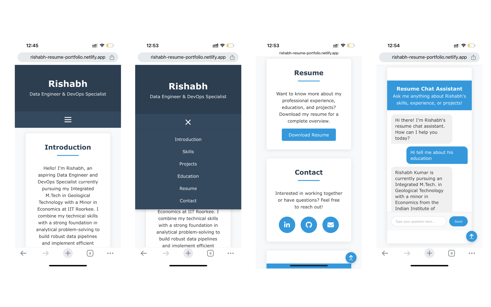

# Rishabh's Portfolio Website

A modern, responsive portfolio website showcasing my skills, projects, and professional experience as a Data Engineer & DevOps Specialist.

## Features

- 🌐 Responsive design that looks great on all devices
- 🔍 Interactive navigation with smooth scrolling
- 📊 Visual skill progress bars
- 🌟 Project showcase with filtering options
- 📄 Downloadable resume
- 💬 Interactive chat assistant powered by LLaMA 3 (via Groq API)

## Table of Contents

- [Demo](#demo)
- [Project Structure](#project-structure)
- [Technologies Used](#technologies-used)
- [Setup Instructions](#setup-instructions)
- [Chat Assistant](#chat-assistant)
- [Customization](#customization)
- [Deployment](#deployment)
- [Screenshots](#screenshots)
- [License](#license)
- [Contact](#contact)

## Demo

[Live Demo](https://rishabh-resume-portfolio.netlify.app/)

## Project Structure

```
portfolio-website/
│
├── assets/
│   ├── Rishabh_Kumar_Resume.pdf
│   ├── favicon.png
│   ├── homepage.png
│   ├── skills.png
│   ├── projects.png
│   ├── chat.png
│   └── mobile.png
│
├── netlify/
│   └── functions/
│       └── chat-bot.js
│
├── bots.js
├── index.html
├── netlify.toml
├── package.json
├── scripts.js
└── styles.css
```

## Technologies Used

- **Frontend**: HTML5, CSS3, JavaScript (ES6+)
- **Styling**: Custom CSS with responsive design
- **Icons**: Font Awesome
- **Serverless Functions**: Netlify Functions
- **AI Integration**: Groq API (LLaMA 3 model)
- **Deployment**: Netlify

## Setup Instructions

1. **Clone the repository**

```bash
git clone https://github.com/Rishabhspace/rishabh-portfolio.git
cd rishabh-portfolio
```

2. **Install dependencies**

```bash
npm install
```

3. **Set up environment variables**

Create a `.env` file in the root directory with your Groq API key:

```
GROQ_API_KEY=your_groq_api_key_here
```

4. **Run locally**

```bash
npm start
```

This will start the development server at `http://localhost:8888`

## Chat Assistant

The portfolio includes an interactive chat assistant that can answer questions about my skills, experience, and projects. It's powered by LLaMA 3 via the Groq API and implemented as a Netlify serverless function.

### How it works:

1. User asks a question in the chat interface
2. The question is sent to a Netlify serverless function
3. The function forwards the query to the Groq API along with my resume data
4. The AI responds with relevant information based on my resume
5. The response is displayed in the chat interface

## Customization

### Modifying Resume Data

Edit the `RESUME_DATA` object in `bots.js` to update your personal information:

```javascript
const RESUME_DATA = {
  name: "Your Name",
  title: "Your Title",
  summary: "Your professional summary",
  // Continue updating other sections...
};
```

### Styling

The website uses a custom CSS file (`styles.css`). You can modify colors, fonts, and layouts by editing this file.

### Adding Projects

Add new projects by updating the HTML in `index.html` and the project data in `bots.js`.

## Deployment

This project is set up for easy deployment on Netlify:

1. Push your code to a GitHub repository
2. Connect your repository to Netlify
3. Set up the environment variable `GROQ_API_KEY` in Netlify's dashboard
4. Deploy!

## Screenshots

### Homepage



### Skills Section



### Projects Section



### Chat Assistant



### Mobile View



## Contact

- **Email**: [rishabhiitroorkee@gmail.com](mailto:rishabhiitroorkee@gmail.com)
- **LinkedIn**: [Rishabh Kumar](https://linkedin.com/in/rishabh-kumar-37240222a)
- **GitHub**: [Rishabhspace](https://github.com/Rishabhspace)

---

Feel free to star ⭐ this repository if you find it useful!
